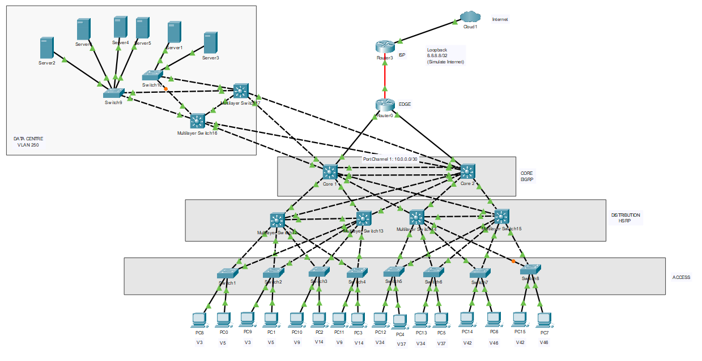

# Enterprise Campus Network — BRKENS-2031

Multi-VLAN enterprise campus with routed core–distribution links, HSRP, EIGRP, DHCP, NAT, and access-layer hardening — built in Cisco Packet Tracer following the [Cisco Live BRKENS-2031](https://www.ciscolive.com/c/dam/r/ciscolive/emea/docs/2023/pdf/BRKENS-2031.pdf) campus design methodology.

---

## Architecture Overview

| Layer | Components | Role |
|-------|-----------|------|
| **Core** | 2x L3 switches | Inter-distribution routing, L3 Port-Channel interconnect |
| **Distribution** | 4x L3 switches | SVIs, HSRP gateways, DHCP server, EIGRP peers, STP roots |
| **Access** | L2 switches | Host connectivity, port security, BPDU Guard, storm control |
| **Edge** | Router | NAT, external connectivity |

### Design Decisions

| Decision | Rationale |
|----------|-----------|
| Routed ports (no switchport) between core and distribution | Eliminates STP dependency in the core path; enables deterministic L3 forwarding and ECMP |
| L3 Port-Channel between core switches | Bandwidth aggregation and resilience without STP convergence delays |
| HSRP active/root alignment per VLAN | Ensures forwarding path matches the STP root bridge, avoiding suboptimal L2 pathing |
| Distribution-layer DHCP | Centralises address management at the distribution tier; reduces reliance on external DHCP servers |
| Route summarization toward core | Reduces core routing table size and SPF computation overhead |

## VLAN and Addressing Scheme

| VLAN | Subnet | Gateway (HSRP VIP) | DSW .2 | DSW .3 |
|------|--------|-------------------|--------|--------|
| 3 | 192.168.3.0/24 | .1 | .2 | .3 |
| 5 | 192.168.5.0/24 | .1 | .2 | .3 |
| 9 | 192.168.9.0/24 | .1 | .2 | .3 |
| 14 | 192.168.14.0/24 | .1 | .2 | .3 |
| 34 | 192.168.34.0/24 | .1 | .2 | .3 |
| 37 | 192.168.37.0/24 | .1 | .2 | .3 |
| 42 | 192.168.42.0/24 | .1 | .2 | .3 |
| 46 | 192.168.46.0/24 | .1 | .2 | .3 |

- DHCP pools per VLAN with first three addresses excluded (.1–.3)
- DNS: 8.8.8.8

---

## Routing and Redundancy

**EIGRP** — Enabled between distribution and core, advertising VLAN subnets and inter-switch networks. Routes summarized at the distribution layer toward the core to minimise routing table churn.

**HSRP** — Active/standby pairs per VLAN across distribution switches. Data centre VLANs use dual HSRP instances for gateway load-balancing.

**Rapid PVST+** — Per-VLAN spanning tree with root bridges aligned to HSRP active gateways.

**NAT** — Configured at the network edge for internal-to-external address translation.

## Access Layer Security

| Control | Configuration |
|---------|--------------|
| **Port Mode** | `switchport mode access` with `nonegotiate` to prevent DTP trunk negotiation |
| **Port Security** | Sticky MAC learning, max 2 MACs, violation mode `restrict` |
| **BPDU Guard** | Enabled on all host-facing ports |
| **PortFast** | Enabled on all host-facing ports |
| **Storm Control** | Broadcast/multicast rate limiting |

## Observations

- Core–distribution routed links provided deterministic forwarding and sub-second convergence on simulated link failures.
- HSRP/STP alignment eliminated asymmetric traffic patterns across distribution pairs.
- Route summarization at the distribution tier kept the core routing table compact and reduced EIGRP query scope.
